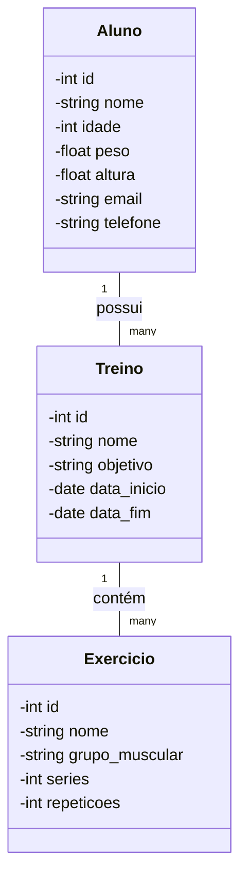

```mermaid

classDiagram
    class Aluno {
        -int id
        -string nome
        -int idade
        -float peso
        -float altura
        -string email
        -string telefone
    }

    class Treino {
        -int id
        -string nome
        -string objetivo
        -date data_inicio
        -date data_fim
    }

    class Exercicio {
        -int id
        -string nome
        -string grupo_muscular
        -int series
        -int repeticoes
    }

    %% Relacionamentos
    Aluno "1" -- "many" Treino : possui
    Treino "1" -- "many" Exercicio : contém


```